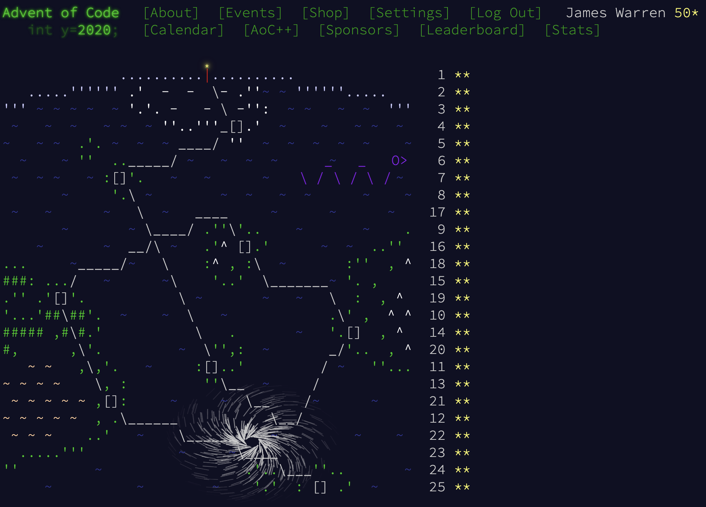

## README

Solutions to [Advent of Code 2020](https://adventofcode.com/2020)

Written in Scala with the intent (perhaps even successful at times) to emphasize clarity and good design over
conciseness and magic.

FP principles followed within reason. Deviations typically due to performance, still using referentially transparent 
functions (e.g. hidden mutable state).